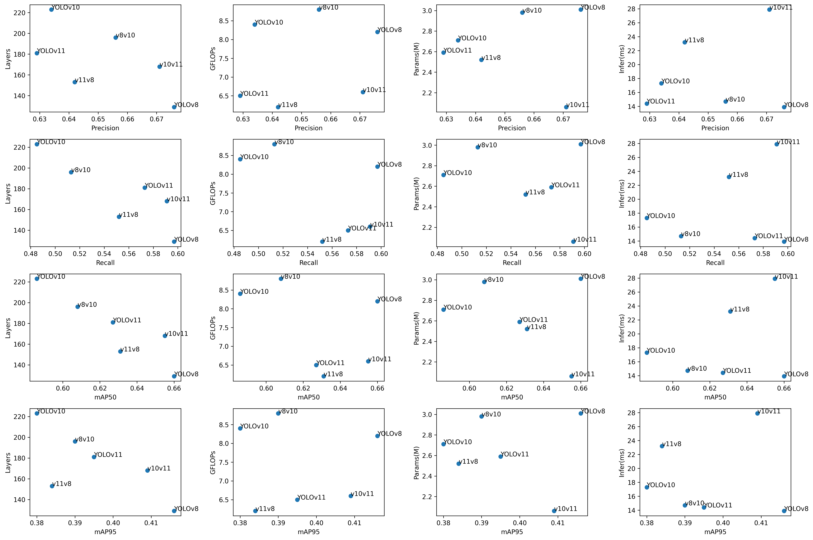
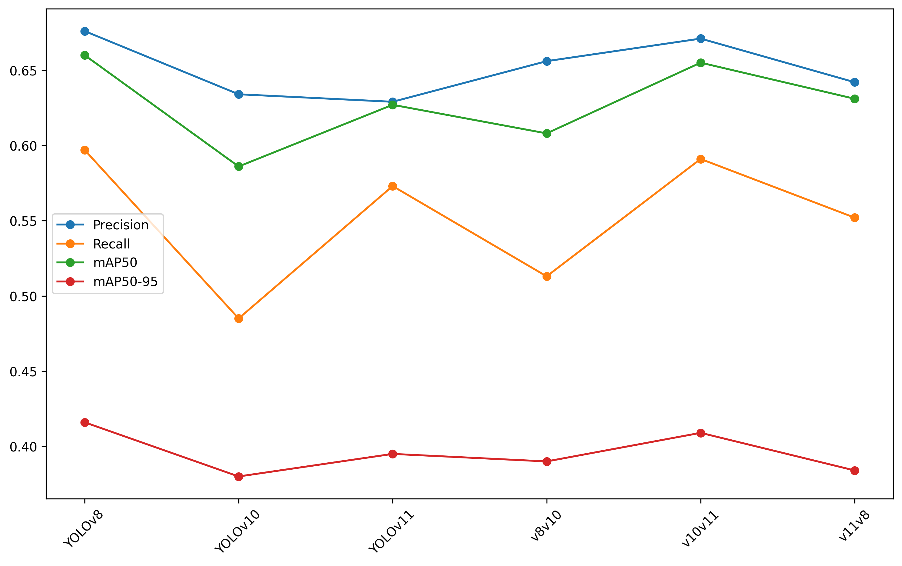
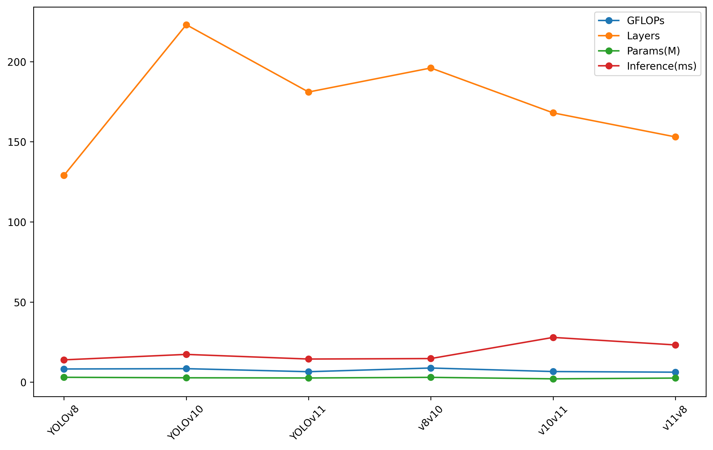
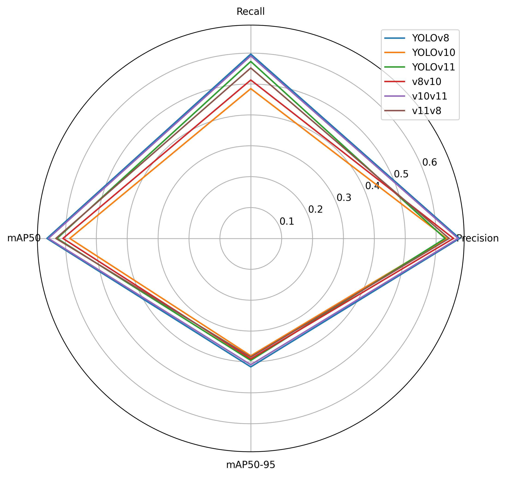
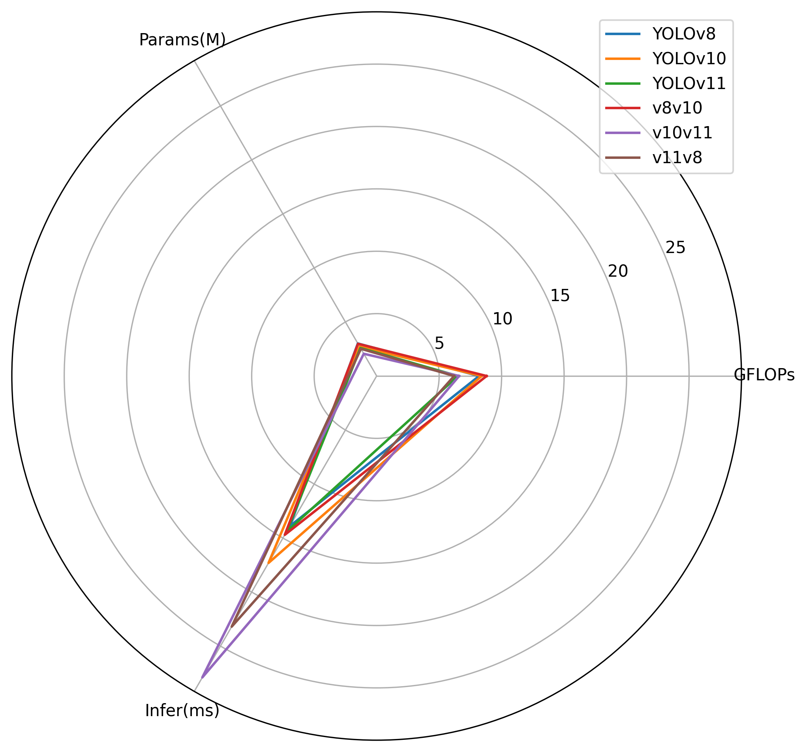

# 🧠 YOLO-Tweaks: Backbone–Head Hybrid Compatibility Experiments Across YOLOv8 / YOLOv10 / YOLOv11  
🚀 **Personal Research Project (Independent Study)**  
📍 *Exploring structural compatibility, scaling behavior, and performance trade-offs across YOLO architectures.*

---

## 🎯 Overview

This project investigates whether mixing and matching **backbones** and **detection heads** across three YOLO generations can produce architectures that are:

- More efficient  
- More accurate  
- Better specialized for tiny-object detection  
- Better balanced between compute and mAP  

Instead of treating YOLO versions as fixed models, this work approaches them as **modular systems**—where backbones, necks, and heads can be recombined to form new hybrids.

All experiments were run on the **AgriPest** tiny-insect dataset.

---

## 🎯 Objective
This project explores how different combinations of backbones and detection heads affect performance on a fine-grained, tiny-object dataset (AgriPest).

Three standard YOLO models are used as baselines, and three custom hybrid architectures are created by mixing/ swapping backbone–head pairs.

The goal is to understand:

1. How compute (params, FLOPs),
2. Feature extraction quality, and
3. Multi-scale detection head design

together influence precision, recall, and mAP.

> Rather than treating YOLO architectures as immutable, this experiment approaches them **as modular systems** — where *backbone–neck–head components* can be recombined to discover hybrid efficiency.
---

## 🧩 Model Variants

### **Baselines**

| Model | Backbone | Head |
|-------|----------|-------|
| YOLOv8 | v8 | v8 |
| YOLOv10 | v10 | v10 |
| YOLOv11 | v11 | v11 |

### **Hybrids**

| Hybrid | Backbone | Head |
|--------|-----------|--------|
| v8v10 | v8 | v10 |
| v10v11 | v10 | v11 |
| v11v8 | v11 | v8 |

Each configuration was implemented via custom YAMLs and validated for tensor-shape integrity within Ultralytics’ PyTorch framework.

---

## 🧱 Architecture Highlights

| Version     | Distinct Structural Traits                                                  |
| :---------- | :-------------------------------------------------------------------------- |
| **YOLOv8**  | C2f modules, simple PAN head, strong dense-feature representation           |
| **YOLOv10** | SCDown, C3k2 blocks, decoupled head → optimized for latency                 |
| **YOLOv11** | C3k2 + CIB + refined scaling for speed–accuracy balance                     |
| **Hybrids** | Combine efficiency modules (v10/v11) with dense representational heads (v8) |

---

## ⚙️ Experimental Setup

| Parameter     | Value                               |
| :------------ | :---------------------------------- |
| Dataset       | **AgriPest (13 classes)**           |
| Image size    | 320                                 |
| Epochs        | 50                                  |
| Patience      | 5                                   |
| Warmup epochs | 5                                   |
| Batch size    | 24                                  |
| Optimizer     | SGD (Ultralytics default)           |
| Device        | CPU — Intel i5-12500                |
| Framework     | Ultralytics 8.3.220 / PyTorch 2.9.0 |

---

## 📂 Dataset

**AgriPest** — a crop-pest dataset featuring small insects across 13 categories.

| Split      | Images |
| :--------- | -----: |
| Train      | 11 502 |
| Validation | 1 095  |
| Test       | 546    |

**Dataset Strucutre**

```
AgriPest/
├── train/
├── valid/
├── test/
└── data.yaml
```

---
---

## 🧮 Model Complexity

| Model | Layers | Parameters (M) | FLOPs (G) |
| :--------- | -----: | ---------: | ----: |
| YOLOv8 | **129** | 3.01 | 8.2 |
| YOLOv10 | 223 | 2.71 | 8.4 |
| YOLOv11 | 181 | 2.59 | 6.5 |
| **v8v10** | 196 | 2.98 | **8.8** |
| **v10v11** | 168 | **2.06** | 6.6 |
| **v11v8** | 153 | 2.52 | **6.2** |

> Hybridization can drastically reduce parameter count and FLOPs. **v10v11** achieved the lowest parameter count (2.06M) and **v11v8** the lowest FLOPs (6.2G).

---

## 📊 Performance Summary

### Validation mAP (AgriPest Valid – 1,095 images)

| Model | Precision | Recall | mAP50 | mAP50-95 |
|--------|----------:|---------:|---------:|------------:|
| **YOLOv8** | **0.676** | 0.597 | **0.660** | **0.416** |
| **YOLOv10** | 0.634 | 0.485 | 0.586 | 0.380 |
| **YOLOv11** | 0.629 | 0.573 | 0.627 | 0.395 |
| **v8v10** | 0.656 | 0.513 | 0.608 | 0.390 |
| **v10v11** | 0.671 | **0.591** | **0.655** | 0.409 |
| **v11v8** | 0.642 | 0.552 | 0.631 | 0.384 |

### Interpretation
- **YOLOv8** remains the most accurate baseline on tiny insects.
- **v10v11** becomes the ***top hybrid***, nearly matching YOLOv8 accuracy (mAP50: 0.655) with significantly lower compute (2.06M params).
- **v11v8** is balanced: strong mAP50 and recall, with the lowest FLOPs (6.2G).

---

## ⏱️ Training & Inference Time

### **Baselines**

| Model | Inference (ms/img) |
|--------|-----------------------:|
| YOLOv8 | 13.9 |
| YOLOv10 | 17.3 |
| YOLOv11 | **14.4** |

### **Hybrids**

| Hybrid | Inference (ms/img) |
|--------|-----------------------:|
| v8v10 | 14.7 |
| v10v11 | 27.9 |
| v11v8 | 23.2 |

> **YOLOv8** shows the fastest inference among all models (13.9 ms), contradicting its highest parameter/FLOP count. This highlights the crucial difference between theoretical FLOPs and actual **CPU-based latency**. **v10v11** has the lowest parameters but the highest inference time (27.9 ms).

---

## 🧠 Summary of All Models

| Model | Type | P | R | mAP50 | mAP50-95 | Params (M) | FLOPs (G) | Infer (ms) |
|-------|------|------:|------:|--------:|------------:|-----------:|----------:|-----------:|
| **YOLOv8** | Baseline | **0.676** | 0.597 | **0.660** | **0.416** | 3.01 | 8.2 | **13.9** |
| **YOLOv11** | Baseline | 0.629 | 0.573 | 0.627 | 0.395 | 2.59 | **6.5** | 14.4 |
| **YOLOv10** | Baseline | 0.634 | 0.485 | 0.586 | 0.380 | 2.71 | 8.4 | 17.3 |
| **v8v10** | Hybrid | 0.656 | 0.513 | 0.608 | 0.390 | 2.98 | **8.8** | 14.7 |
| **v10v11** | Hybrid | 0.671 | **0.591** | **0.655** | 0.409 | **2.06** | 6.6 | 27.9 |
| **v11v8** | Hybrid | 0.642 | 0.552 | 0.631 | 0.384 | 2.52 | **6.2** | 23.2 |

---

## 📈 Visualizations (Results)

### 1. Accuracy vs. Efficiency Trade-offs (Pairwise Metrics)
These plots show how performance metrics (X-axis) are affected by complexity metrics (Y-axis), revealing no simple linear relationship on the AgriPest dataset.



### 2. Performance Line Plot
The performance metrics across models, highlighting **YOLOv8** and the **v10v11** hybrid as accuracy leaders.



### 3. Efficiency Line Plot
This chart tracks Layers, FLOPs, Parameters, and Inference Time across the six models. Note the high layer count for YOLOv10 and the counter-intuitive speed of YOLOv8.



### 4. Normalized Performance-Efficiency (Parallel Coordinates)
This plot normalizes all metrics (1.0 = best, 0.0 = worst) to visualize the overall profile of each model.


### 5. Multi-Metric Radar Plots

#### Performance Comparison (Accuracy)
Higher area indicates better overall detection quality. **YOLOv8** and **v10v11** show the largest performance footprint.



#### Efficiency Comparison (Compute/Latency)
Lower area indicates better efficiency (lower FLOPs, Params, and Inference time). **YOLOv11** is the most efficient by FLOPs/Params, while **YOLOv8** is fastest by latency.



### 6. Metric Correlation Analysis

This heatmap shows the Pearson correlation coefficient between all performance and efficiency metrics.


**Key Correlation Insights from Heatmap:**

* **Accuracy Metrics** are highly positively correlated ($\ge 0.71$).
* **Latency vs. Compute:** Inference time is **highly negatively correlated** with both FLOPs and Parameters ($-0.60$ and $-0.89$, respectively). This is a critical finding, indicating that the theoretical complexity (FLOPs/Params) is **decoupled** from actual CPU-based inference latency. Faster models in this test had higher parameter counts.
* **mAP vs. Efficiency:** Accuracy metrics (mAP50-95) show very low correlation with FLOPs ($-0.04$) and Params ($-0.07$), suggesting that complexity **does not guarantee** better performance on this tiny-object dataset.

---

## 🔍 Observations & Insights

### What this experiment reveals:

* **Hybrid Success:** The **v10v11** hybrid (YOLOv10 Backbone + YOLOv11 Head) is the top performer, achieving near-YOLOv8 accuracy (mAP50: **0.655** vs. **0.660**) with significantly lower parameters (**2.06M** vs. **3.01M**). This confirms that modern, efficient head designs can be effectively paired with an older, feature-rich backbone to create an optimized architecture.
* **Efficiency vs. Latency Decoupling:** The experiment strongly suggests that **GFLOPs and Parameter count are poor proxies for real-world CPU inference latency** on this specific hardware. The high negative correlation between Parameters and Inference Time ($\approx -0.89$) is a major observation, implying that architectural factors (e.g., memory access, highly optimized kernels) are dominating the overhead, not just the raw FLOPs.
* **Head Design Matters for Tiny Objects:** Models using the dense, simple **YOLOv8 Head** (YOLOv8, v11v8) generally achieved higher $\text{mAP50-95}$, suggesting the v8 head is more effective at resolving the fine-grained, tiny features characteristic of the AgriPest dataset compared to the decoupled/efficient heads of v10 and v11.

---

## 🔮 Future Work

1.  **Investigate the $\text{Params}-\text{Inference}$ Discrepancy:** Perform detailed profiling (e.g., PyTorch profiler) to pinpoint the architectural or operational causes of the highly negative correlation between parameter count and CPU inference time.
2.  Plot architecture-efficiency curves ($\text{mAP}$ vs. $\text{FLOPs}$ vs. $\text{Params}$) to better visualize the Pareto frontier.
3.  Evaluate hybrid stability on more datasets (COCO-subset / BCCD).
4.  Export hybrids to ONNX / TorchScript for speed benchmarking.

---

## 📚 Key Takeaways

* **Architectural Literacy** $\rightarrow$ Understanding YOLO internals beyond API usage.
* **Feature-Head Synergy** $\rightarrow$ The **v10v11** hybrid proves that mixing generations can preserve high accuracy with reduced theoretical compute.
* **Efficiency-Accuracy Trade-off** $\rightarrow$ Lower GFLOPs/Params **do not necessarily** equate to lower $\text{mAP}$ or faster real-world inference; architectural and memory-access optimizations are paramount for latency.

---

## 🧾 Author

**Y. R. A. V. R** — Hyderabad, India
🔗 [LinkedIn](https://www.linkedin.com/in/yravr/) | [GitHub](https://github.com/Y-R-A-V-R-5/YOLO-TWEAKS)

---

## 📎 References

- [Ultralytics YOLOv8 → v11 Releases](https://github.com/ultralytics/ultralytics)
- [SCDown and C3k2 modules (YOLOv10 paper)](https://arxiv.org/abs/2405.14458)
- [CIB Blocks and Hybrid Heads (YOLOv11)](https://github.com/ultralytics/ultralytics/releases)
- [AgriPest Dataset](https://www.kaggle.com/datasets/rupankarmajumdar/crop-pests-dataset)

---

### ⚡ README Snapshot Summary

> *“YOLO-Tweaks” demonstrates how a hands-on learner can dissect and recombine architectures across model generations — moving from training usage to genuine architectural experimentation.*
> > *This repository demonstrates architectural literacy, experimental thinking, and hands-on model engineering — transitioning from model usage to genuine structural exploration.*


