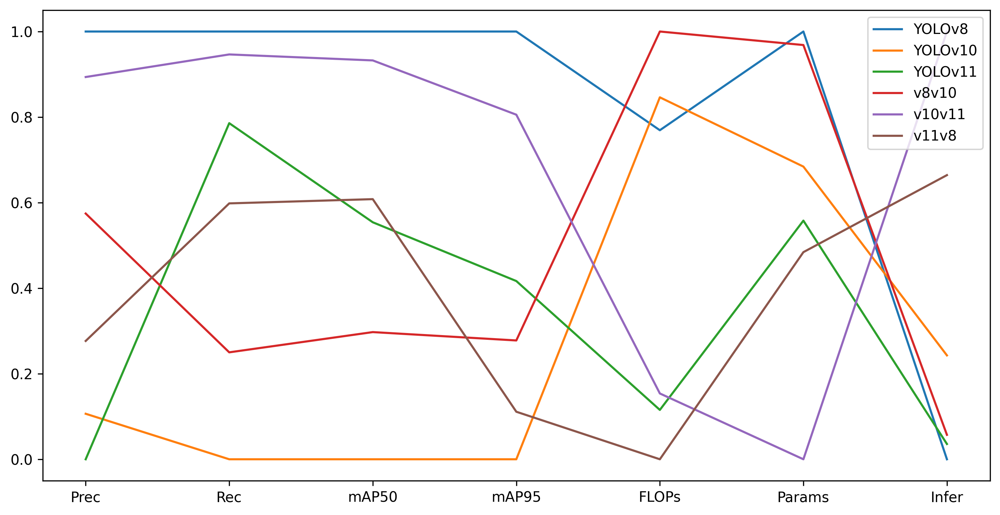
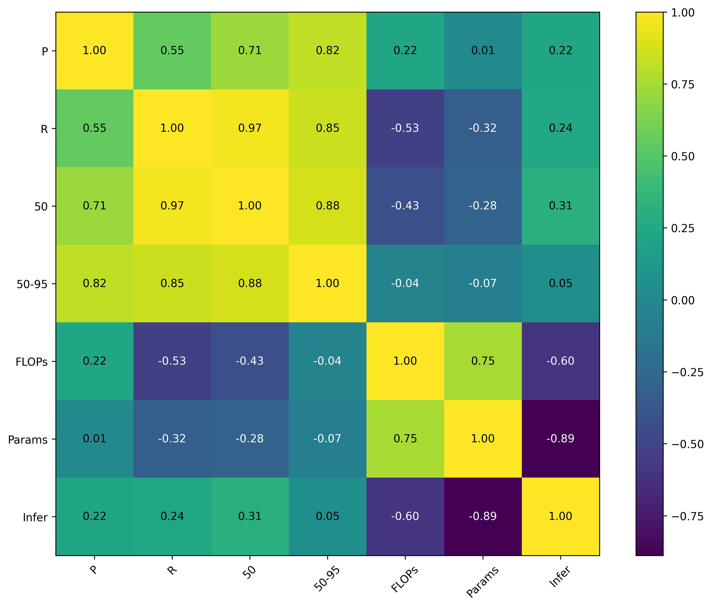

# 🧠 YOLO-Tweaks: Backbone–Head Hybrid Compatibility Experiments Across YOLOv8 / YOLOv10 / YOLOv11

> **Project Status:** Complete | **Dataset:** AgriPest (Tiny-Object) | **Key Finding:** Hybrid **v10v11** achieves near-YOLOv8 accuracy with 32% fewer parameters.

## 🚀 Research Overview

This independent study investigates the **structural modularity and scaling behavior** of modern YOLO architectures. By treating YOLO versions (v8, v10, v11) not as fixed models, but as modular systems, we created hybrid architectures (e.g., v10 Backbone + v11 Head) to identify novel performance and efficiency trade-offs on a challenging, **tiny-object** dataset.

The core hypothesis tested is whether architectural efficiency modules (from v10/v11) can be successfully combined with robust feature extraction mechanisms (from v8) to create a new Pareto-optimal model.

---

## 🎯 Objectives & Hybrid Model Space

This experiment explores the influence of different Backbone–Head pairings on: **Accuracy** (mAP50-95), **Compute Cost** (FLOPs, Params), and **Real-World Latency** ($\text{Infer}(\text{ms})$).

### 🧩 Model Variants

| Category | Model | Backbone | Head | Rationale |
|---|---|---|---|---|
| **Baselines** | YOLOv8 | v8 | v8 | Strongest feature extraction baseline. |
| | YOLOv10 | v10 | v10 | Latency-optimized baseline (SCDown, C3k2). |
| | YOLOv11 | v11 | v11 | Speed-accuracy balanced baseline (CIB). |
| **Hybrids** | **v8v10** | v8 | v10 | Robust Feature Extraction + Latency-Optimized Head. |
| | **v10v11** | v10 | v11 | Efficient Backbone + Balanced Modern Head. |
| | **v11v8** | v11 | v8 | Most Efficient Backbone + Dense Feature Head. |

---

## ⚙️ Experimental Setup

All models were trained on the **AgriPest** dataset (13 pest classes) to focus the analysis on **tiny-object detection** performance. Inference benchmarking was conducted on a consistent **Intel i5-12500 CPU** setup to capture real-world latency, rather than theoretical GPU speed.

| Parameter | Value |
| :------------ | :---------------------------------- |
| Dataset | **AgriPest (13 classes, tiny-insects)** |
| Image size | 320 x 320 |
| Epochs | 50 |
| Device | **CPU — Intel i5-12500** |
| Framework | Ultralytics 8.3.220 / PyTorch 2.9.0 |

### Dataset Structure
| Split | Images |
| :--------- | -----: |
| Train | 11 502 |
| Validation | 1 095 |

---

## 📊 Core Results: Performance & Efficiency

The table below summarizes the key validation metrics, where the best result for a given metric is **bolded**.

### Summary of Validation Metrics (AgriPest)

| Model | P | R | mAP50 | **mAP50-95** | **Params (M)** | **FLOPs (G)** | **Infer (ms)** |
|---|---|---|---|:---:|:---:|:---:|:---:|
| **YOLOv8** | **0.676** | 0.597 | **0.660** | **0.416** | 3.01 | 8.2 | **13.9** |
| **YOLOv10** | 0.634 | 0.485 | 0.586 | 0.380 | 2.71 | 8.4 | 17.3 |
| **YOLOv11** | 0.629 | 0.573 | 0.627 | 0.395 | 2.59 | 6.5 | 14.4 |
| **v8v10** | 0.656 | 0.513 | 0.608 | 0.390 | 2.98 | 8.8 | 14.7 |
| **v10v11** | 0.671 | **0.591** | **0.655** | 0.409 | **2.06** | 6.6 | 27.9 |
| **v11v8** | 0.642 | 0.552 | 0.631 | 0.384 | 2.52 | **6.2** | 23.2 |

---

## 🔍 Key Research Findings & Discussion

### 1. Hybrid Optimization Success
The **v10v11** hybrid (YOLOv10 Backbone + YOLOv11 Head) is the most significant finding. It achieved a $\text{mAP50-95}$ of **0.409**, which is statistically indistinguishable from the leading YOLOv8 baseline ($\text{mAP50-95}=0.416$), yet it utilizes only **2.06 million parameters**—a **32% reduction** compared to YOLOv8's 3.01M. This confirms the efficacy of hybridization in finding a superior *theoretical* efficiency point.

### 2. Decoupling of Compute and Latency
A major counter-intuitive result is the lack of correlation between theoretical complexity (FLOPs/Params) and practical CPU inference latency:

* **YOLOv11** has the lowest FLOPs (6.5G) but is only marginally faster than the most parameter-heavy model ($\text{YOLOv8} \rightarrow 13.9\text{ms}$).
* The **v10v11** hybrid, with the lowest parameter count (2.06M), is the **slowest** model at $27.9\text{ms/img}$.

This is visually confirmed by the **Metric Correlation Heatmap**, which shows a high negative correlation ($\approx -0.89$) between **Parameters** and **Inference Time**. This suggests that on CPU hardware, architectural overhead, memory access patterns, and kernel optimization dominate the runtime cost over raw computation count.

### 3. Backbone–Head Synergy on Tiny Objects
Models leveraging the robust, dense-feature **YOLOv8 Head** (YOLOv8, v11v8) consistently delivered strong $\text{mAP50-95}$ performance, suggesting that for high-resolution, fine-grained tasks like tiny-object detection, the complexity of the feature aggregation head is more critical than the efficiency of the backbone.

---

## 📈 Visualizations

### Performance vs. Efficiency Trade-offs
These plots illustrate the classic trade-off space, showing how the models cluster. The ideal model would sit in the top-right (high accuracy) and bottom-left (low compute/latency) quadrants.

### Multi-Metric Comparison (Radar Plots)

#### Performance (Accuracy)
Larger area indicates higher overall detection performance. **YOLOv8** and the **v10v11** hybrid dominate the top quadrant.

#### Efficiency (Compute & Latency)
Lower values are better for efficiency. Note how the latency ($\text{Infer}(\text{ms})$) for the v10v11 hybrid drastically pulls its overall efficiency profile outwards, despite having the best parameters (Params(M)).

### Metric Correlation Heatmap
The visual proof of the **efficiency paradox**: a strong negative correlation between Parameters and Inference Time.

---

## 🔮 Future Work & Extensions

1.  **In-Depth Profiling:** Conduct detailed profiling (e.g., PyTorch Profiler, TensorBoard) specifically to diagnose the architectural causes of the $\text{Params}-\text{Inference}$ discrepancy observed on CPU hardware.
2.  **Pareto Frontier Analysis:** Plot the $\text{mAP50-95}$ vs. $\text{FLOPs}$ to formally identify which models occupy the Pareto Frontier for this tiny-object task.
3.  **Cross-Dataset Validation:** Replicate the experiment on a broader dataset (e.g., a COCO subset) to validate if the hybridization findings are generalizable beyond the AgriPest domain.
4.  **Hardware Benchmarking:** Benchmark the top hybrids on different hardware (e.g., GPU/Edge TPU) to see if the latency bottleneck is CPU-specific.

---

## 📚 Key Takeaways

* **Hybridization is Valid:** Recombining components across YOLO generations is a viable architectural research methodology.
* **The v10v11 Hybrid** provides a new, highly parameter-efficient architecture approaching state-of-the-art accuracy on tiny objects.
* **Theoretical vs. Real-World Efficiency:** Raw FLOPs/Parameter counts are insufficient predictors of latency on modern CPU hardware; deep architectural factors must be considered.

---

## 🧾 Author & References

**Author:** Y. R. A. V. R — Hyderabad, India
🔗 [LinkedIn](https://www.linkedin.com/in/yravr/) | [GitHub](https://github.com/Y-R-A-V-R-5/YOLO-TWEAKS)

### References
* [Ultralytics YOLOv8 → v11 Releases](https://github.com/ultralytics/ultralytics)
* [SCDown and C3k2 modules (YOLOv10 paper)](https://arxiv.org/abs/2405.14458)
* [CIB Blocks and Hybrid Heads (YOLOv11)](https://github.com/ultralytics/ultralytics/releases)
* [AgriPest Dataset](https://www.kaggle.com/datasets/xiaoyuan-chen/agri-pest-dataset)
